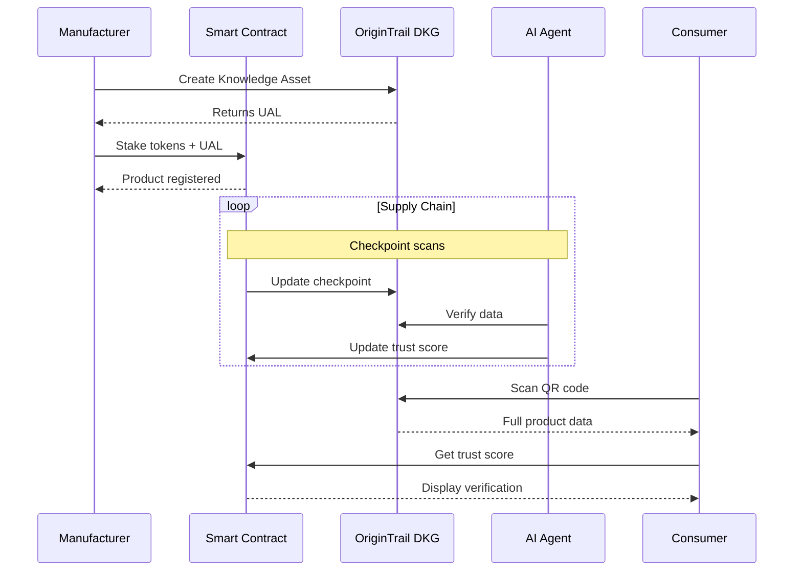

# 🛡️ Provena: AI-Verified Supply Chain Provenance

<div align="center">


[](LICENSE)
[](https://neuroweb.ai/)

**A decentralized platform that verifies product authenticity throughout the supply chain using AI agents, blockchain technology, and the OriginTrail Decentralized Knowledge Graph.**

[Demo](https://trustchain.demo) • [Documentation](#documentation) • [Video](https://youtube.com/trustchain)

</div>

---

## 📋 Table of Contents

- [Overview](#overview)
- [The Problem](#the-problem)
- [Our Solution](#our-solution)
- [Architecture](#architecture)
- [Key Features](#key-features)
- [Technology Stack](#technology-stack)
- [Getting Started](#getting-started)
  - [Prerequisites](#prerequisites)
  - [Installation](#installation)
  - [Deployment](#deployment)
- [Usage](#usage)
- [Smart Contract](#smart-contract)
- [Project Structure](#project-structure)
- [Roadmap](#roadmap)
- [Contributing](#contributing)
- [Team](#team)
- [License](#license)

---

## 🎯 Overview

Provena combats the **$500+ billion global counterfeit goods market** by creating an immutable, AI-verified trail of product provenance. Every product gets a digital twin on the blockchain, verified by autonomous AI agents at each supply chain checkpoint.

### Quick Demo Flow

```
Manufacturer creates product → Stakes tokens → Generates QR code
    ↓
Product moves through supply chain → Each checkpoint scanned
    ↓
AI agents verify each checkpoint → Update trust score
    ↓
Consumer scans QR code → Views full verified journey → Makes confident purchase
```

---

## 🚨 The Problem

### Current Supply Chain Issues

- **💰 $500B+** annual counterfeit goods market
- **📄 Paper-based** documentation easily forged
- **🔒 Opaque** supply chains with no visibility
- **❌ Zero accountability** for bad actors
- **😰 Consumer mistrust** in product authenticity

### Real-World Impact

- Fake pharmaceuticals causing deaths
- Counterfeit electronics in critical infrastructure
- Food fraud affecting millions
- Luxury goods counterfeiting damaging brands
- Consumer safety at risk

---

## ✨ Our Solution

Provena creates a **decentralized trust layer** for global commerce by:

### 🤖 AI-Powered Verification
- Autonomous agents verify every checkpoint
- Detect anomalies in real-time (impossible transit times, location spoofing)
- Pattern recognition for fraud detection
- Image authenticity verification

### 🔗 Blockchain Provenance
- Immutable product history on OriginTrail DKG
- Token staking creates skin-in-the-game
- Multi-chain architecture (NeuroWeb + Moonbeam)
- Transparent audit trails

### 💎 Economic Incentives
- Honest suppliers earn rewards (20% bonus)
- Fraudsters lose stakes (slashing mechanism)
- Reputation system amplifies trust
- Self-sustaining ecosystem

### 👥 Consumer Empowerment
- Scan QR code for instant verification
- View complete supply chain journey
- AI-generated trust score (0-100)
- Make informed purchase decisions

---

## 🏗️ Architecture

### Three-Layer Design

```
┌─────────────────────────────────────────────────┐
│              🤖 AGENT LAYER                     │
│  ┌──────────────────────────────────────────┐  │
│  │  AI Verification Agents                  │  │
│  │  • Anomaly Detection                     │  │
│  │  • Fraud Detection                       │  │
│  │  • Trust Score Calculation               │  │
│  │  • Pattern Recognition                   │  │
│  └──────────────────────────────────────────┘  │
│            ↕ MCP Protocol                       │
└─────────────────────────────────────────────────┘
                     ↓
┌─────────────────────────────────────────────────┐
│           📚 KNOWLEDGE LAYER                    │
│  ┌──────────────────────────────────────────┐  │
│  │  OriginTrail DKG (via Edge Node)         │  │
│  │  • Product Knowledge Assets              │  │
│  │  • Supply Chain Event Records            │  │
│  │  • Stakeholder Profiles                  │  │
│  │  • Trust Metrics                         │  │
│  └──────────────────────────────────────────┘  │
│         Stored as JSON-LD/RDF                   │
└─────────────────────────────────────────────────┘
                     ↓
┌─────────────────────────────────────────────────┐
│            🔐 TRUST LAYER                       │
│  ┌──────────────────────────────────────────┐  │
│  │  NeuroWeb Parachain                      │  │
│  │  • Knowledge Mining                      │  │
│  │  • AI-first blockchain                   │  │
│  │                                          │  │
│  │  Moonbeam Parachain                      │  │
│  │  • Smart Contracts (TrustStaking.sol)   │  │
│  │  • Token Staking & Rewards               │  │
│  │  • Automated Slashing                    │  │
│  └──────────────────────────────────────────┘  │
│       Connected via Polkadot XCM                │
└─────────────────────────────────────────────────┘
```

### Data Flow



---

## 🌟 Key Features

### For Manufacturers
- ✅ **Easy Product Registration** - Simple web interface
- ✅ **QR Code Generation** - Print on packaging
- ✅ **Reputation Building** - Build trust with consumers
- ✅ **Reward System** - Earn 20% bonus for verified products

### For Distributors/Logistics
- ✅ **Mobile Checkpoint Scanning** - Quick and easy
- ✅ **Automatic Verification** - AI validates instantly
- ✅ **Earn Rewards** - Get paid for transparency
- ✅ **Reputation Tracking** - Build trusted partner status

### For Consumers
- ✅ **Instant Verification** - Scan QR code with phone
- ✅ **Trust Score** - AI-calculated 0-100 score
- ✅ **Full Journey** - See complete supply chain
- ✅ **Blockchain Proof** - Verify on-chain
- ✅ **No App Required** - Works in mobile browser

### For the Ecosystem
- ✅ **Fraud Detection** - AI catches anomalies automatically
- ✅ **Transparent Auditing** - All data verifiable
- ✅ **Self-Sustaining** - Token economics create alignment
- ✅ **Interoperable** - Multi-chain architecture

---

## 🛠️ Technology Stack

### Blockchain & Web3
- **Smart Contracts**: Solidity ^0.8.20
- **Primary Chain**: Moonbeam Parachain (Moonbase Alpha Testnet)
- **Knowledge Graph**: OriginTrail DKG (NeuroWeb Parachain)
- **Wallet Integration**: RainbowKit
- **Web3 Library**: Wagmi + Viem
- **Development**: Hardhat

### Frontend
- **Framework**: Next.js 14 (App Router)
- **Language**: TypeScript
- **Styling**: Tailwind CSS
- **State Management**: React Hooks + TanStack Query
- **QR Code**: react-qr-code

### Backend
- **API**: Node.js + Express
- **DKG Integration**: @origintrail/dkg-client
- **AI Verification**: Python (FastAPI) + TensorFlow

### Infrastructure
- **DKG Edge Node**: OriginTrail official node
- **IPFS**: Decentralized file storage
- **Deployment**: Vercel (Frontend) + Railway (Backend)

---

## 🚀 Getting Started

### Prerequisites

Before you begin, ensure you have:

- **Node.js** v18+ and npm
- **MetaMask** or compatible Web3 wallet
- **Git**
- **Moonbase Alpha DEV tokens** ([Faucet](https://faucet.moonbeam.network/))
- **NeuroWeb testnet tokens** ([Faucet](https://neuroweb.ai/faucet))
- **DKG Edge Node** ([Installation Guide](https://docs.origintrail.io))

### Installation

#### 1️⃣ Clone Repository

```bash
git clone https://github.com/yourusername/trustchain.git
cd trustchain
```

#### 2️⃣ Setup Smart Contract

```bash
cd contract

# Install dependencies
npm install

# Create environment file
cp .env.example .env
# Edit .env and add your PRIVATE_KEY

# Compile contracts
npx hardhat compile

# Deploy to Moonbase Alpha testnet
npx hardhat run scripts/deploy.js --network neuroweb-testnet

# Note the deployed contract address!
```

#### 3️⃣ Setup Frontend

```bash
cd ../frontend

# Install dependencies
npm install

# Create environment file
cp .env.example .env.local

# Edit .env.local:
# NEXT_PUBLIC_WALLETCONNECT_PROJECT_ID=your_project_id
# NEXT_PUBLIC_CONTRACT_ADDRESS=0x... (from deployment)

# Start development server
npm run dev
```

#### 4️⃣ Setup Backend (DKG Integration)

```bash
cd ../backend

# Install dependencies
npm install

# Create environment file
cp .env.example .env

# Edit .env:
# DKG_ENDPOINT=http://localhost:8900
# NEUROWEB_PUBLIC_KEY=your_public_key
# NEUROWEB_PRIVATE_KEY=your_private_key

# Start server
npm run dev
```

#### 5️⃣ Setup DKG Edge Node

```bash
# Follow official installation guide
# https://docs.origintrail.io/getting-started/decentralized-knowle-dge-graph-dkg

# Quick start:
docker pull origintrail/dkg-node:latest
docker run -d --name dkg-node \
  -p 8900:8900 \
  -e BLOCKCHAIN_NAME=neuroweb:testnet \
  origintrail/dkg-node:latest
```

### Deployment

#### Deploy Smart Contract

```bash
cd contract

# Deploy to Moonbase Alpha
npx hardhat run scripts/deploy.js --network neuroweb-testnet

# Verify on Moonscan (optional)
npx hardhat verify --network neuroweb-testnet DEPLOYED_CONTRACT_ADDRESS
```

#### Deploy Frontend (Vercel)

```bash
cd frontend

# Install Vercel CLI
npm i -g vercel

# Deploy
vercel

# Set environment variables in Vercel dashboard
```

#### Deploy Backend (Railway)

```bash
cd backend

# Initialize Railway
railway init

# Deploy
railway up

# Set environment variables in Railway dashboard
```

---

## 📖 Usage

### For Manufacturers

1. **Connect Wallet**
   - Visit the TrustChain app
   - Click "Connect Wallet"
   - Select MetaMask or preferred wallet

2. **Create Product**
   - Fill in product details:
     - Product ID (or generate automatically)
     - Product name
     - Origin location
   - Set stake amount (minimum 0.01 DEV)
   - Click "Create Product & Stake"

3. **Get QR Code**
   - Wait for transaction confirmation
   - Download generated QR code
   - Print on product packaging

### For Logistics Partners

1. **Scan Checkpoint**
   - Use mobile browser to scan product QR
   - Click "Add Checkpoint"
   - Capture GPS location automatically
   - Add location name
   - Submit checkpoint

2. **AI Verification**
   - AI agent verifies automatically
   - Checkpoint marked as verified
   - Trust score updated
   - Reward credited (if applicable)

### For Consumers

1. **Verify Product**
   - Scan QR code with phone camera
   - View trust score (0-100)
   - See complete supply chain journey
   - Check AI verification status

2. **Make Decision**
   - Trust score ≥90: High confidence
   - Trust score 75-89: Medium confidence
   - Trust score <75: Low confidence, investigate
   - View blockchain proof for full transparency

---

## 📜 Smart Contract

### TrustStaking.sol

**Deployed on Moonbase Alpha**: `0x...` (add after deployment)

#### Main Functions

```solidity
// Create product and stake tokens
function createProduct(
    string memory _productId,
    string memory _productName,
    string memory _dkgUAL
) external payable

// Add supply chain checkpoint
function addCheckpoint(
    string memory _productId,
    string memory _location
) external

// Update trust score (AI agent)
function updateTrustScore(
    string memory _productId,
    uint256 _newScore
) external

// Claim rewards (if trust score ≥ 90)
function claimReward(
    string memory _productId
) external

// Slash stake for fraud
function slashStake(
    string memory _productId,
    string memory _reason
) external
```

#### Events

```solidity
event ProductCreated(string indexed productId, address indexed manufacturer, uint256 stakeAmount, string dkgUAL)
event CheckpointAdded(string indexed productId, string location, address indexed handler, uint256 timestamp)
event TrustScoreUpdated(string indexed productId, uint256 oldScore, uint256 newScore)
event RewardClaimed(string indexed productId, address indexed recipient, uint256 amount)
event StakeSlashed(string indexed productId, address indexed manufacturer, uint256 amount, string reason)
```

---

## 📁 Project Structure

```
trustchain/
├── contract/                      # Smart contracts
│   ├── contracts/
│   │   └── TrustStaking.sol      # Main contract
│   ├── scripts/
│   │   └── deploy.js             # Deployment script
│   ├── test/
│   │   └── TrustStaking.test.js  # Contract tests
│   ├── hardhat.config.js         # Hardhat configuration
│   └── package.json
│
├── frontend/                      # Next.js application
│   ├── app/
│   │   ├── layout.tsx            # Root layout with RainbowKit
│   │   ├── providers.tsx         # Web3 providers
│   │   ├── page.tsx              # Manufacturer dashboard
│   │   ├── verify/
│   │   │   └── [productId]/
│   │   │       └── page.tsx      # Verification page
│   │   └── api/
│   │       └── dkg/
│   │           ├── create.ts     # Create Knowledge Asset
│   │           └── query.ts      # Query Knowledge Asset
│   ├── components/
│   │   ├── ConnectButton.tsx
│   │   ├── ProductForm.tsx
│   │   ├── TrustScore.tsx
│   │   └── SupplyChainTimeline.tsx
│   ├── hooks/
│   │   └── useContract.ts        # Contract interaction hook
│   ├── lib/
│   │   ├── contract.ts           # Contract ABI & address
│   │   └── dkg.ts                # DKG client utilities
│   ├── public/
│   └── package.json
│
├── backend/                       # Express API
│   ├── src/
│   │   ├── server.js             # Main server
│   │   ├── routes/
│   │   │   └── dkg.js            # DKG routes
│   │   ├── services/
│   │   │   ├── dkgService.js     # DKG operations
│   │   │   └── aiService.js      # AI verification
│   │   └── utils/
│   │       └── helpers.js
│   └── package.json
│
├── ai-agent/                      # Python AI service
│   ├── src/
│   │   ├── main.py               # FastAPI server
│   │   ├── agents/
│   │   │   ├── anomaly_detector.py
│   │   │   ├── fraud_detector.py
│   │   │   └── trust_calculator.py
│   │   └── models/
│   ├── requirements.txt
│   └── Dockerfile
│
├── docs/                          # Documentation
│   ├── ARCHITECTURE.md
│   ├── API.md
│   └── DEPLOYMENT.md
│
├── .gitignore
├── LICENSE
└── README.md                      # This file
```

---

## 🗺️ Roadmap

### ✅ Phase 1: MVP (Hackathon - 3 Days)
- [x] Smart contract deployment
- [x] Product creation and staking
- [x] Basic checkpoint scanning
- [x] Consumer verification page
- [x] QR code generation
- [x] Trust score calculation

### 🚧 Phase 2: AI Enhancement (Week 1-2)
- [ ] Advanced anomaly detection algorithms
- [ ] Image authenticity verification
- [ ] Pattern recognition for fraud
- [ ] Predictive analytics
- [ ] Machine learning model training

### 📅 Phase 3: Multi-Chain Expansion (Week 3-4)
- [ ] Full NeuroWeb integration
- [ ] Acala payment integration
- [ ] Cross-chain messaging (XCM)
- [ ] x402 micropayment protocol
- [ ] Multi-chain data aggregation

### 🎯 Phase 4: Production Ready (Month 2-3)
- [ ] Mobile apps (iOS/Android)
- [ ] IoT sensor integration
- [ ] Enterprise dashboard
- [ ] API for third-party integrations
- [ ] Mainnet deployment

### 🌟 Phase 5: Scale (Month 3+)
- [ ] 10,000+ products tracked
- [ ] Partner with major brands
- [ ] Global logistics integration
- [ ] Regulatory compliance (FDA, CE)
- [ ] Carbon footprint tracking

---

## 🤝 Contributing

We welcome contributions from the community! Here's how you can help:

### Ways to Contribute

1. **🐛 Report Bugs**
   - Open an issue with detailed description
   - Include steps to reproduce
   - Add screenshots if applicable

2. **💡 Suggest Features**
   - Open an issue with feature proposal
   - Explain use case and benefits
   - Discuss implementation approach

3. **🔧 Submit Pull Requests**
   - Fork the repository
   - Create feature branch (`git checkout -b feature/AmazingFeature`)
   - Commit changes (`git commit -m 'Add AmazingFeature'`)
   - Push to branch (`git push origin feature/AmazingFeature`)
   - Open Pull Request

4. **📖 Improve Documentation**
   - Fix typos or unclear explanations
   - Add examples and tutorials
   - Translate to other languages

### Development Guidelines

- Follow existing code style
- Write clear commit messages
- Add tests for new features
- Update documentation
- Ensure all tests pass

### Code of Conduct

Please read our [Code of Conduct](CODE_OF_CONDUCT.md) before contributing.

---

## 👨‍💻 Team

### Core Contributors

- **[Your Name]** - Frontend & Smart Contracts - [@yourhandle](https://github.com/yourhandle)
- **[Teammate 2]** - Backend & DKG Integration /AI/ML & Algorithms- [@handle2](https://github.com/handle2)


### Advisors & Mentors

- **OriginTrail Team** - DKG Integration Support
- **NeuroWeb Team** - Smart Contract Guidance

---

## 📄 License

This project is licensed under the **MIT License** - see the [LICENSE](LICENSE) file for details.

---

## 🙏 Acknowledgments

- **OriginTrail** for the Decentralized Knowledge Graph
- **NeuroWeb** for the EVM-compatible parachain
- **Polkadot** for the multi-chain infrastructure
- **RainbowKit** for beautiful wallet integration
- **Hackathon Organizers** for the opportunity

---

## 📞 Contact & Support

### Get Help

- **Documentation**: [docs.trustchain.io](https://docs.trustchain.io)
- **Discord**: [Join our server](https://discord.gg/trustchain)
- **Email**: support@trustchain.io
- **Twitter**: [@TrustChainApp](https://twitter.com/trustchainapp)

### Report Issues

Found a bug? [Open an issue](https://github.com/yourusername/trustchain/issues)

### Security

Found a security vulnerability? Email security@trustchain.io

---


<div align="center">

**Built with ❤️ for the future of trusted commerce**

[⬆ Back to Top](#️-trustchain-ai-verified-supply-chain-provenance)

</div>